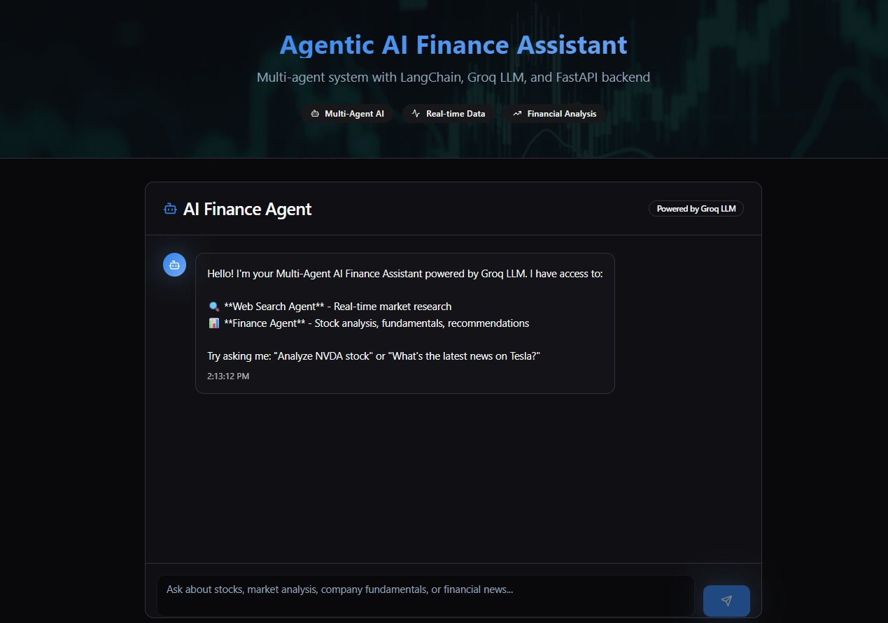

# Mr Finance Multi Agent 💹🤖

**Mr Finance Multi Agent** is an end-to-end AI-powered financial assistant that integrates a **FastAPI backend** with a **React + Vite frontend**. It leverages the **Groq API** (LLM inference engine) through the **phi framework** to provide intelligent financial insights and market analysis.

   

<p align="left">
  
</p>

## 🚀 Features

- **Multi-Agent Architecture**: Specialized AI agents for different financial tasks
- **Real-time Market Data**: Live stock prices, news, and financial metrics
- **Web Search Integration**: Latest financial news and market trends
- **Interactive Dashboard**: Modern React UI with real-time updates
- **RESTful API**: FastAPI backend with auto-generated documentation

## 🏗️ Architecture

```
┌─────────────────┐    ┌─────────────────┐    ┌─────────────────┐
│   Frontend      │    │    Backend      │    │   AI Agents     │
│                 │    │                 │    │                 │
│ React + Vite    │◄──►│ FastAPI + Groq  │◄──►│ Finance Agent   │
│ TypeScript      │    │ Python 3.11+    │    │ Web Search      │
│ Tailwind CS     │    │ Uvicorn Server  │    │ Multi-Agent     │
│                 │    │ Phi Framework   │    │                 │
└─────────────────┘    └─────────────────┘    └─────────────────┘
```

## 🔧 Tech Stack

### Backend

- **Python 3.11+**
- **FastAPI** - Modern, fast web framework
- **Uvicorn** - ASGI server implementation
- **Phi Framework** - Agent orchestration
- **Groq API** - High-performance LLM inference
- **YFinance** - Stock market data
- **DuckDuckGo Search** - Web search capabilities

### Frontend

- **React 18** - Modern UI library
- **Vite** - Lightning-fast build tool
- **TypeScript** - Type-safe development
- **TailwindCSS** - Utility-first styling
- **Framer Motion** - Smooth animations

## 📁 Project Structure

```
mr-finance-multi-agent/
│
├── backend/
│   ├── main.py              # FastAPI application entrypoint
│   |
├── frontend/
│   ├── src/
│   │   ├── components/      # React components
│   │   ├── pages/          # Application pages
│   │   ├── hooks/          # Custom React hooks
│   │   └── lib/            # Utility functions
│   ├── package.json        # Node dependencies
│   ├── vite.config.ts     # Vite configuration
│   └── tailwind.config.ts # Tailwind configuration
│
└── README.md              # Project documentation
```

## 🚀 Quick Start

### Prerequisites

- Python 3.11+
- Node.js 18+
- Groq API Key ([Get one here](https://groq.com))

### 1. Clone the Repository

```bash
git clone https://github.com/your-username/mr-finance-multi-agent.git
cd mr-finance-multi-agent
```

### 2. Backend Setup

```bash
cd backend

# Create virtual environment
python -m venv venv
source venv/bin/activate   # Linux/Mac
# venv\Scripts\activate    # Windows

# Install dependencies
pip install groq phi etc etc


# Start the server
uvicorn main:app --reload --host 0.0.0.0 --port 8000
```

**Backend runs at:** `http://127.0.0.1:8000`  
**API Documentation:** `http://127.0.0.1:8000/docs`

### 3. Frontend Setup

```bash
cd frontend

# Install dependencies
npm install

# Start development server
npm run dev
```

**Frontend runs at:** `http://localhost:8080`

## 🤖 AI Agents

### 1. Finance Agent 📈

- **Purpose**: Real-time stock market data and analysis
- **Tools**: YFinance API integration
- **Capabilities**:
  - Stock prices and historical data
  - Company financials (P/E, EPS, revenue)
  - Analyst recommendations
  - Market news and earnings reports
  - Technical indicators

### 2. Web Search Agent 🌐

- **Purpose**: Latest financial news and market trends
- **Tools**: DuckDuckGo Search API
- **Capabilities**:
  - Real-time financial news
  - Market sentiment analysis
  - Economic indicators
  - Industry trends
  - Always provides sources

### 3. Multi-Agent Coordinator 🤝

- **Purpose**: Intelligent query routing and response synthesis
- **Capabilities**:
  - Determines optimal agent for each query
  - Combines insights from multiple agents
  - Ensures coherent and comprehensive responses
  - Manages conversation context

## 💡 Example Queries

| Query Type         | Example                                              | Agent Used              |
| ------------------ | ---------------------------------------------------- | ----------------------- |
| Stock Analysis     | "What is Apple's current stock price and P/E ratio?" | Finance Agent           |
| Market News        | "Latest news about cryptocurrency regulations"       | Web Search Agent        |
| Combined Analysis  | "Tesla's stock performance vs EV market trends"      | Multi-Agent Coordinator |
| Financial Planning | "Best dividend stocks for 2024 with current yields"  | Both Agents             |

## 🛠️ API Endpoints

### Chat Endpoints

- `POST /api/chat` - Send message to AI agents
- `GET /api/chat/history` - Retrieve conversation history

### Agent Endpoints

- `POST /api/agents/finance` - Direct finance agent queries
- `POST /api/agents/search` - Direct web search queries
- `GET /api/agents/status` - Agent health status

### Market Data Endpoints

- `GET /api/market/quote/{symbol}` - Get stock quote
- `GET /api/market/news/{symbol}` - Get stock news
- `GET /api/market/trending` - Get trending stocks

## 🎨 UI Components

### Dashboard Features

- **Real-time Market Overview** - Live market indices and trending stocks
- **Interactive Chat Interface** - AI-powered financial assistant
- **Portfolio Tracker** - Personal investment monitoring
- **News Feed** - Latest financial news with AI summaries
- **Market Analytics** - Charts and technical analysis

### Design System

- **Dark Theme** - Professional financial terminal aesthetic
- **Responsive Design** - Mobile-first approach
- **Accessibility** - WCAG 2.1 compliant components
- **Animations** - Smooth transitions and micro-interactions

## 🔐 Environment Variables

### Backend (.env)

```env
GROQ_API_KEY=your_groq_api_key
```

## 🤝 Contributing

1. Fork the repository
2. Create your feature branch (`git checkout -b feature/AmazingFeature`)
3. Commit your changes (`git commit -m 'Add some AmazingFeature'`)
4. Push to the branch (`git push origin feature/AmazingFeature`)
5. Open a Pull Request

## 📄 License

This project is licensed under the MIT License .
